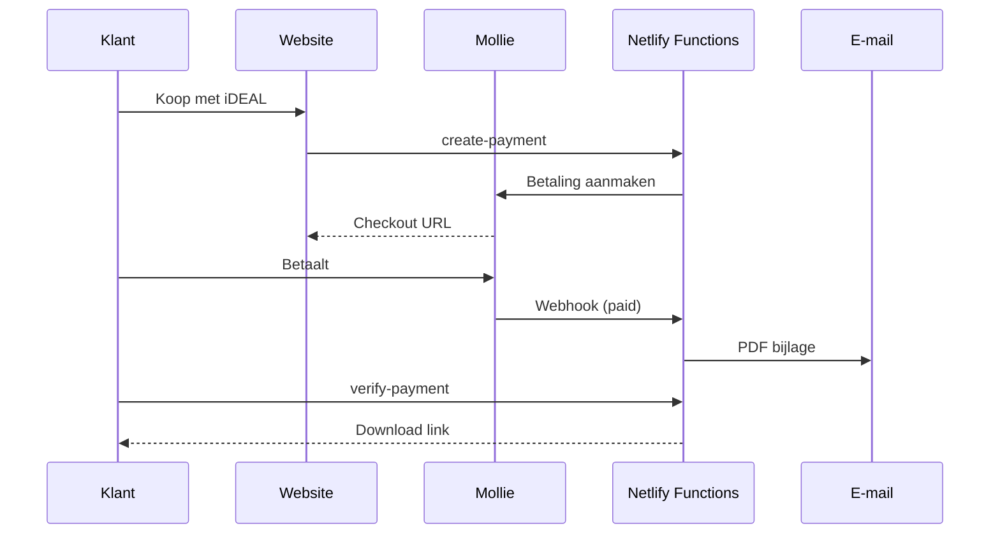

# Automatische PDF-levering — Huizenmarkt Nederland

Dit document legt uit wat er gebeurt na een betaling, welke instellingen je nodig hebt, en hoe je het test.

---

## Wat de klant ervaart

1. Klant klikt op **Koop met iDEAL**
2. Klant betaalt via Mollie
3. Klant komt op `bedankt.html`
4. PDF wordt **automatisch per e-mail** verstuurd
5. PDF is ook **direct downloadbaar** op de bedankpagina
6. Geen mail? Contact via info@huizenmarkt-nederland.nl

---

## Architectuur (vereenvoudigd)



---

## Netlify environment variables

### Verplicht

| Variabele | Voorbeeld |
|-----------|-----------|
| `MOLLIE_API_KEY` | `live_xxx` of `test_xxx` |
| `FROM_EMAIL` | `info@huizenmarkt-nederland.nl` |
| `FROM_NAME` | `Huizenmarkt Nederland` |

### E-mail — optie A: Resend

| Variabele | Voorbeeld |
|-----------|-----------|
| `RESEND_API_KEY` | `re_xxx` |

### E-mail — optie B: SMTP

| Variabele | Voorbeeld |
|-----------|-----------|
| `SMTP_HOST` | `mail.privateemail.com` |
| `SMTP_PORT` | `587` |
| `SMTP_USER` | `info@huizenmarkt-nederland.nl` |
| `SMTP_PASS` | wachtwoord |
| `SMTP_SECURE` | `false` |

### Optioneel (testen)

| Variabele | Uitleg |
|-----------|--------|
| `MOCK_WEBHOOK_SECRET` | Simuleer webhook via mock-webhook |

> Zonder Resend/SMTP werkt betaling wel; klant krijgt downloadknop + supportmail.

---

## PDF-bestanden

In `website/downloads/`:
- `starter-pack-Q3-2026.pdf`
- `beleggings-pack-Q3-2026.pdf`

---

## Testen

1. Zet `MOLLIE_API_KEY=test_...`
2. Testbetaling op site
3. Check inbox + bedankpagina

Webhook simuleren:

```bash
curl -X POST "https://SITE/.netlify/functions/mock-webhook?secret=GEHEIM" \
  -H "Content-Type: application/json" \
  -d '{"paymentId":"tr_xxx"}'
```

---

## Noodplan

Zet in `config.js`: `checkout: 'links'` voor handmatige payment links.
